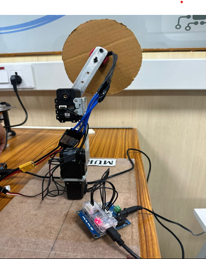

# 3DOF Robotic Arm with Circular Saw

## Author

Ellur Mouneesh

## About the Project

This project involves the construction of a 3 Degrees of Freedom (3DOF) robotic arm equipped with an electric circular saw as its end effector, designed for cutting applications.

### Features

- **Robotic Arm**: The arm is equipped with multiple joints and links, simulating human arm movements. Servo motors drive these joints, allowing for versatile movement in various directions and orientations.
- **Circular Saw Cutter**: Attached at the end of the robotic arm, this circular saw is powered by an electric motor. It can be programmed to execute precise cutting patterns and paths.

### Advantages

- **Precision**: Achieves high accuracy in repetitive cuts.
- **Productivity**: Enhances efficiency by automating cutting tasks.
- **Safety**: Reduces human errors and fatigue by automating manual cutting tasks.

### Summary

This robotic arm with a circular saw cutter is a powerful tool that offers flexibility and precision, making it suitable for a wide range of industrial applications. It combines the mechanical capabilities of a robotic arm with the cutting efficiency of a circular saw to provide automated cutting solutions.

### Components Used

- **AX12-A Servo Motor**
- **U2D2 Power Hub Board**
- **U2D2**
- **Aluminium Links**
- **Circular Saw**
- **BLDC Motor**
- **Raspberry Pi 4B**
- **LiPo Battery**
- **ESC Wires**
- **X3P, X4P Wires**

## Installation

To configure the Raspberry Pi to control the robotic arm, you will need the following tools installed on your machine:

- **Raspberry Pi Imager**: Use this to install the operating system on your Desktop. [Download Raspberry Pi Imager](https://www.raspberrypi.org/software/)
- **VNC Viewer**: This allows you to remotely control your Raspberry Pi. [Download VNC Viewer](https://www.realvnc.com/en/connect/download/viewer/)
- **PuTTY**: This is used for SSH connections to your Raspberry Pi. [Download PuTTY](https://www.putty.org/)

Follow the guides provided on their respective download pages to install these tools and set up your Raspberry Pi using WiFi.

## Usage

To operate the robotic arm, you will need to understand both forward and inverse kinematics:

- **Forward Kinematics**: Code for moving the arm is fully functional and can be found in the `forward_kinematics.py` file.
- **Inverse Kinematics**: We encountered issues with the configuration while implementing the inverse kinematics code. If you have experience with these systems, your input would be greatly appreciated to resolve these problems.

## Contributing

Contributions are welcome, especially from those with experience in mechanical design, coding in Python, and Raspberry Pi configurations. Here is how you can contribute:

- **Coding**: Help improve the code for inverse kinematics, or suggest better algorithms for motion control.

To get started, fork the repository, make your changes, and submit a pull request. We are excited to see your innovative ideas and contributions!

## License

Specify the license under which this project is released.
 

