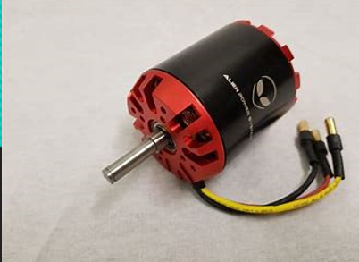

### AX-12A Servo Motor

The AX-12A servo motor is a popular model from the Dynamixel series developed by Robotis. It is known for its compact size and precise control capabilities.

#### Specifications
- **Dimensions**: 32.2 mm x 50.6 mm x 40 mm
- **Weight**: 54 grams
- **Operating Voltage**: 9V to 12V DC
- **Stall Torque**: 15 Kg/cm
- **Maximum Speed**: 114 RPM
- **Gear Ratio**: 254:1
- **Position Feedback**: Resolution of 0.29 degrees
- **Operating Range**: 300-degree range

### U2D2 Power Hub and Driver

The U2D2 Power Hub Board is designed to supply power to Dynamixel servos, supporting both TTL and RS-485 interfaces.

#### Specifications
- **Operating Voltage**: 7.4 to 24V
- **Maximum Current**: 10A
- **Dimensions**: 48 x 57 mm
- **Features**: SMPS port, terminal block, 2P power connector, power switch, TTL and UART ports for serial communication with Dynamixel servos.

### Raspberry Pi 4B

The Raspberry Pi 4B is a powerful microcomputer that serves as the brain of many robotic projects, including this robotic arm.

#### Specifications
- **Processor**: Broadcom BCM2711, Quad-core Cortex-A72 (ARM v8) 64-bit SoC @ 1.8GHz
- **Memory**: 1GB, 2GB, 4GB, or 8GB LPDDR4-3200 SDRAM
- **Connectivity**: 2.4 GHz and 5.0 GHz IEEE 802.11ac wireless, Bluetooth 5.0, BLE, Gigabit Ethernet
- **Ports**: 2 USB 3.0, 2 USB 2.0, 2 × micro-HDMI, 2-lane MIPI DSI display port, 2-lane MIPI CSI camera port
- **Audio/Video**: 4-pole stereo audio and composite video port
- **Graphics**: H.265 (4kp60 decode), H264 (1080p60 decode, 1080p30 encode), OpenGL ES 3.1, Vulkan 1.0
- **Storage**: Micro-SD card slot
- **Additional**: Power over Ethernet (PoE) capability, operating temperature 0 – 50 degrees C ambient

### BLDC Motor

BLDC motors are integral for high-performance applications requiring efficient, reliable, and durable motorization.

#### Specifications
- **Voltage Rating**: Typically 12V, 24V, or 48V
- **Power Rating**: The power rating of a BLDC motor specifies the maximum power it can handle or deliver. It is usually measured in watts (W) or kilowatts (kW).
- **Speed Range**:: BLDC motors can have different speed ranges depending on the specific model and application. The speed is typically measured in revolutions per minute (RPM) or radians per second (rad/s).
- **Torque**:The torque rating of a BLDC motor indicates the rotational force it can produce. It is often measured in Newton-meters (Nm) or ounce-inches (oz-in). BLDC motors can have a continuous torque rating as well as a peak or stall torque rating.
- **Efficiency**: Notably high compared to other motor types
- **Control Method**: : BLDC motors require electronic commutation to control the energization of the stator coils. Common control methods include trapezoidal commutation and sinusoidal commutation, which affect the motor's performance and smoothness of operation.

